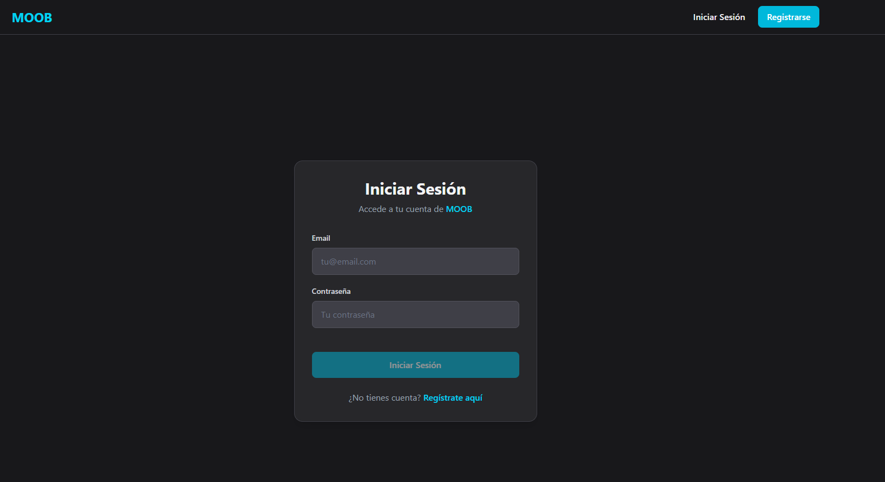
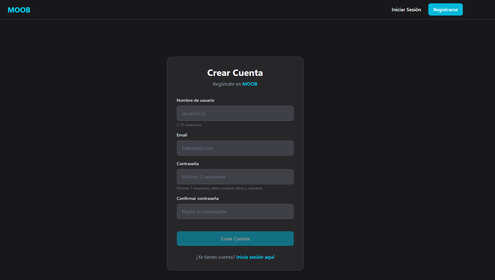
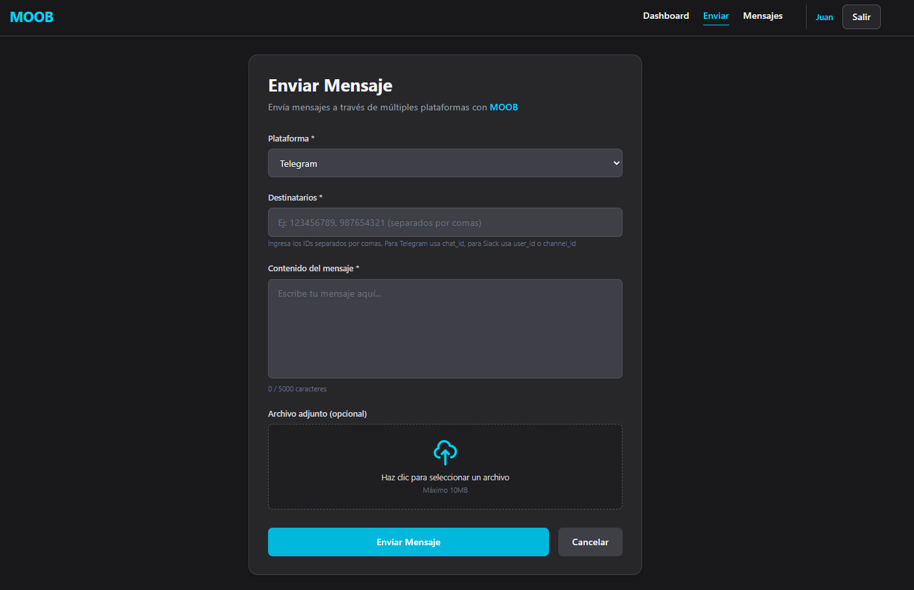
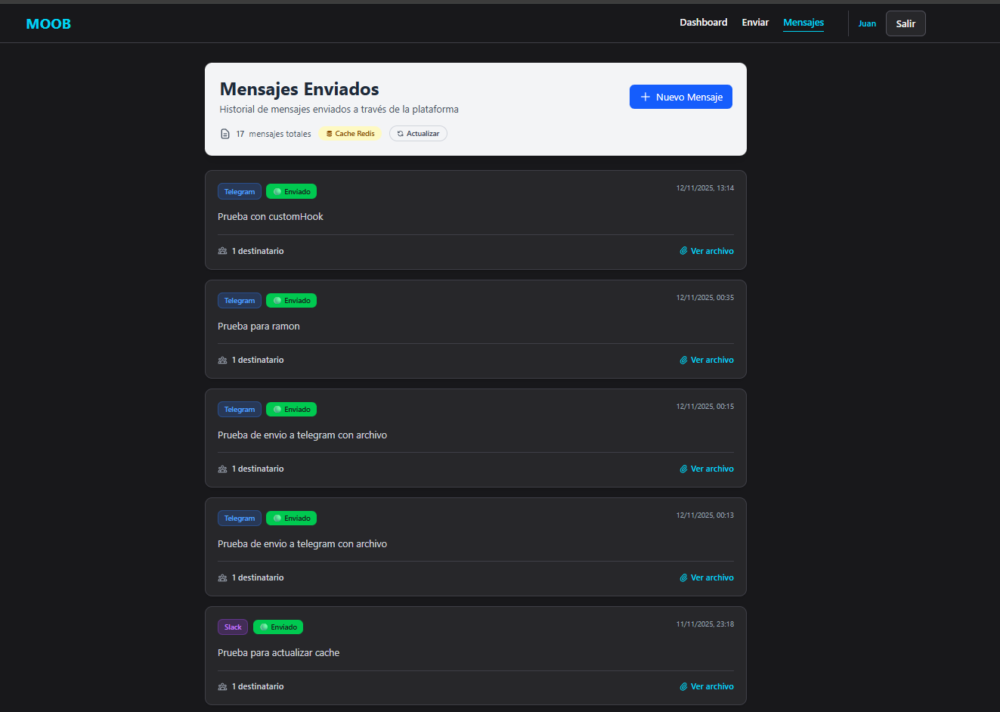
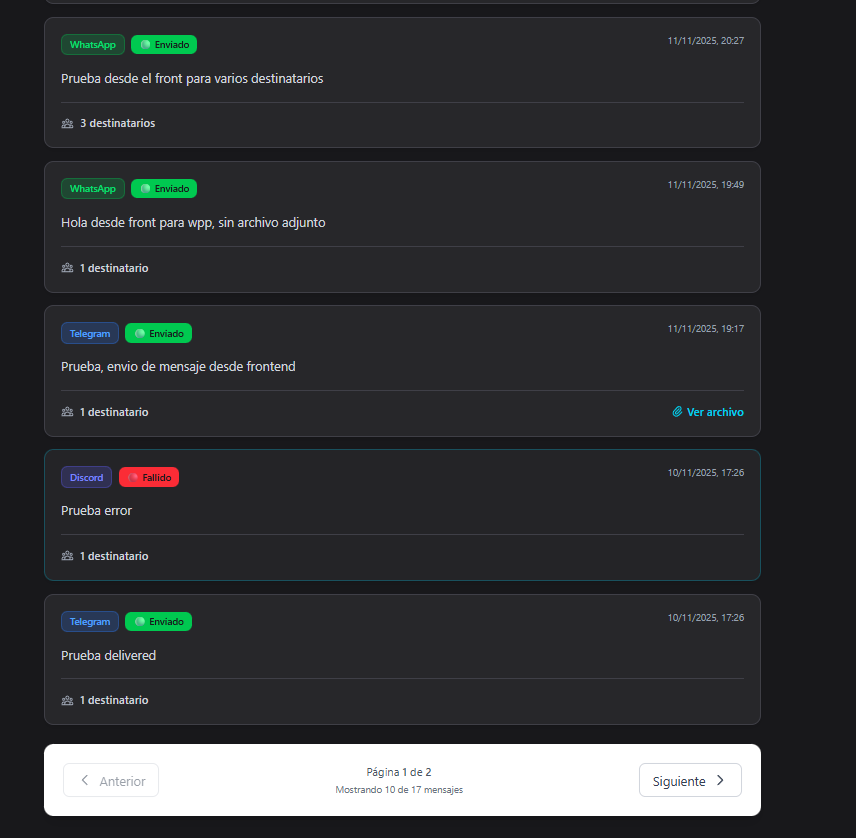
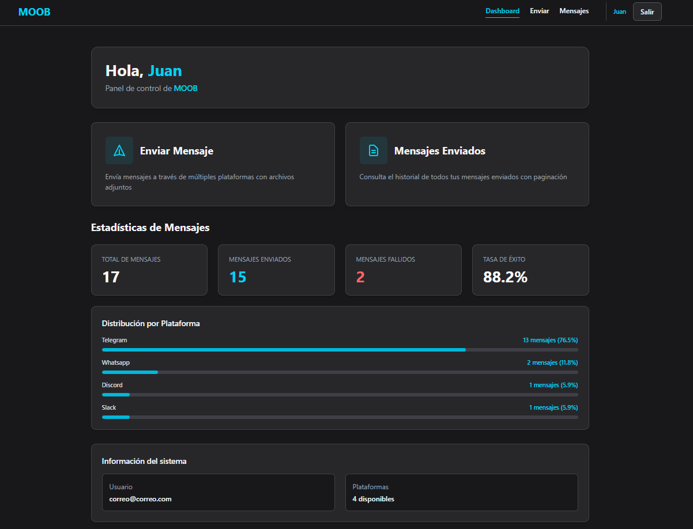

# Frontend MOOB - React + Vite + TypeScript + TailwindCSS

Aplicacion frontend para MOOB challenge desarrollada en React, Vite, TypeScript y estilos con TailwindCSS. En el front encontraremos las paginas de login, register, dashboard, mensajes enviados y por ultimo el formulario para poder crear nuevos mensajes. El login y el formulario se encargan de autenticar el usuario que esta intentando ingresar mediante los JWT traidos del backend y en el caso de registrarse observa que tanto el nombre como el mail no esten ustilizados en itras cuentas tambien haciendo uso del backend y la DB.

En el Dashboard encontraremos un navbar con botondes de navegacion, luego en el cuerpo las dos opciones para enviar mensaje o ver los que ya fueron enviados junto a las estadisticas de estos las cuales fueron creadas en el backend. Pasando por la pagina de envios hacemos uso de los endpoint sendMessage y sendMassMessage para determinar si son mensajes individuales o una difusion con mas de un destinatario. En la pagina de enviados obtenemos todos los mensajes que corresponden al userId que esta autenticado con el JWT y los paginamos de a 10 para que las consultas sean mas eficientes. Estos datos los obtenemos de la cache o de la DB segun la invalidacion manual manejada en el backend.

Para los estilos decidi usar el framework Tailwind lo que me permitio generar estilos de una manera rapida ya que al agregar las clases directamente ahorre mucho tiempo ya que no tuve que crear codigo CSS.

### Tech Stack

- **React 18** - UI library
- **Vite** - Build tool and dev server
- **TypeScript** - Type safety
- **TailwindCSS** - Utility-first CSS framework
- **React Router DOM** - Client-side routing
- **Axios** - HTTP client
- **JWT** - Auth

### Instalación y configuración

1. Clonar el repositorio:
   git clone https://github.com/AgustinMurad/frontendMoob
   cd messages-api

2. Instalar dependencias:
   npm install

3. Archivo `.env`

4. Iniciar servidor
   npm run dev

---

### Estructura de vistas

**Rutas publicas**

- `/login` - Formulario de autenticación del usuario.
  
- `/register` - Registro de nuevos usuarios.
  

**Rutas protegidas**

- `/send` - Formulario para enviar mensajes con archivo opcional.
  
- `/sent` - Listado paginado de mensajes enviados.
  
  
- `/dashboard` - Resumen general y estadísticas del usuario (Redireccion default).
  

---

### Dashboard y estadísticas

El Dashboard muestra métricas obtenidas desde el endpoint /messages/stats del backend:

**Total de mensajes**
**Mensajes enviados / fallidos**
**Tasa de éxito**
**Distribución por plataforma**

---

### Estilos

Estilo dark minimalista, coherente con la estética MOOB.
Paleta de grises con acentos en cian (#06b6d4).

### Conexión con el backend

Toda la comunicación con la API se realiza mediante Axios usando el token JWT.

- JWT almacenados en localStorage
- Inyeccion de token automatizado en API request via axios
- Auto-redirect a login ante respuesta con status 400

### Routing

- **Rutas publicas**: `/login`, `/register`
- **Rutas protegidas**: `/dashboard`, `/messages/send`, `/messages/sent`
- Redireccion default a `/dashboard`

### Autor

Desarrollado por Agustín Murad
Challenge técnico — MOOB Club
